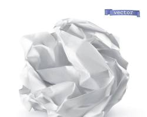

---
hide:
  - navigation
  - toc
---

<h1 align="center" style="font-family: 'Noto Serif SC', serif; font-size: 3em; margin-bottom: 0;">SCIRecycle Journal</h1>

<h2 style="margin-top: 0; color: var(--md-default-fg-color--light); font-weight: normal;">"Turning Today's Garbage into Tomorrow's Citations."</h2>
<h3 style="margin-top: 5px; color: var(--md-default-fg-color--light); font-weight: normal;">“此处不留爷，自有留爷处。”</h3>

  

    <h2 style="margin-top: 0; margin-bottom: 10px; font-family: 'Noto Serif SC', serif;">社论 / EDITORIAL</h2>
    

    
    
<strong>创刊宣言：学术去中心化</strong>

    
欢迎来到 SCIRecycle 期刊。这不仅仅是一个收容“学术垃圾”的仓库，它更是一个关于发声、平权与思想自由的开源实验。

    
每个人都有自己独特感兴趣的话题。在传统的评价体系里，这些话题往往被盖上“太小”、“缺乏宏大叙事”或“微不足道”的印章。但在 SCIRecycle，没有绝对的边缘。我们坚信，任何真实的思考，都值得被当作课题去研究，值得被公开展示。

    
这里没有垄断话语权的“学阀”，没有父权制的说教，也没有被规训的凝视。好的思想自带浮力，它会在完全平等的环境中自然地浮现上来。

  

  

    <h2 style="margin-top: 0; margin-bottom: 10px; font-family: 'Noto Serif SC', serif;">最新动态 / LATEST NEWS</h2>
    

    <ul style="padding-left: 0; list-style-type: none;">
      <li style="margin-bottom: 20px;">
        
08 MAR 2026

        <strong>SCIRecycle 官方网站正式上线</strong> 
        致力于保存、同行评审并发表计算机科学领域绝对最糟糕的实践。
      </li>
      <li style="margin-bottom: 20px;">
        
01 MAR 2026

        <strong>安慰剂优化算法引发关注</strong> 
        本刊收录首篇论文。实验表明，人为增加 2.5 秒延迟后，前端进度条的加载过程显得更加“专业且沉稳”。
      </li>
      <li>
         
        <strong>征稿通道持续开放中</strong> 
        欢迎投递那些被各大顶刊无情拒稿的“学术孤儿”。
      </li>
    </ul>
  

